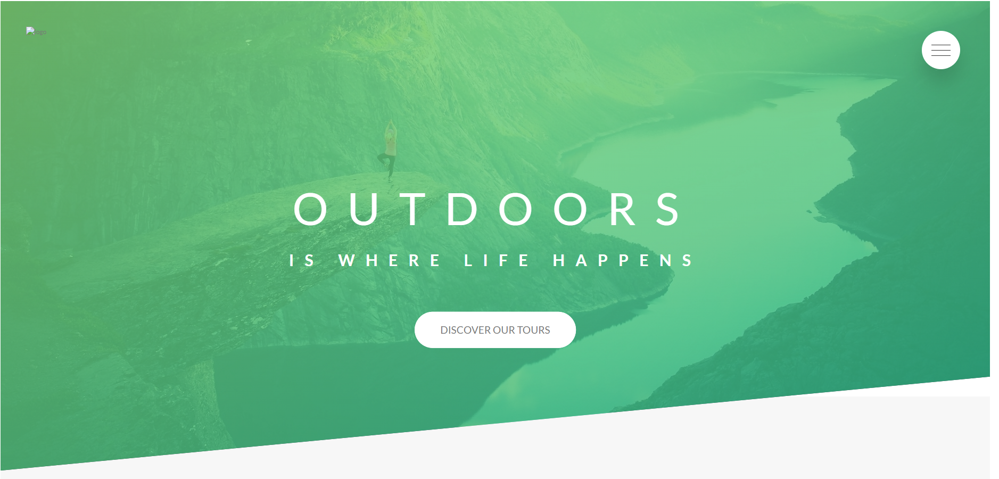
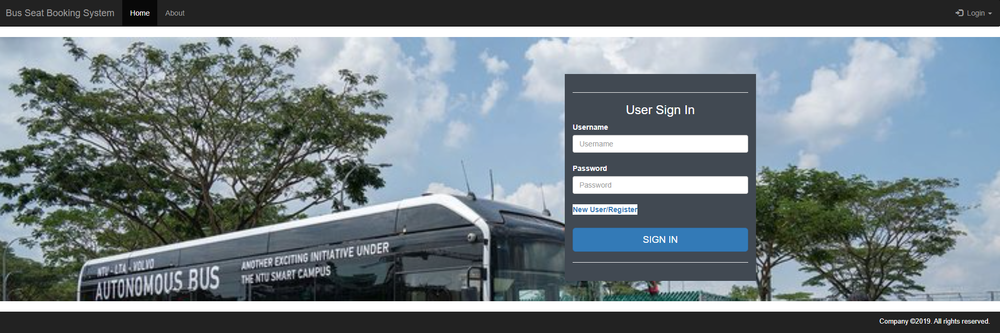
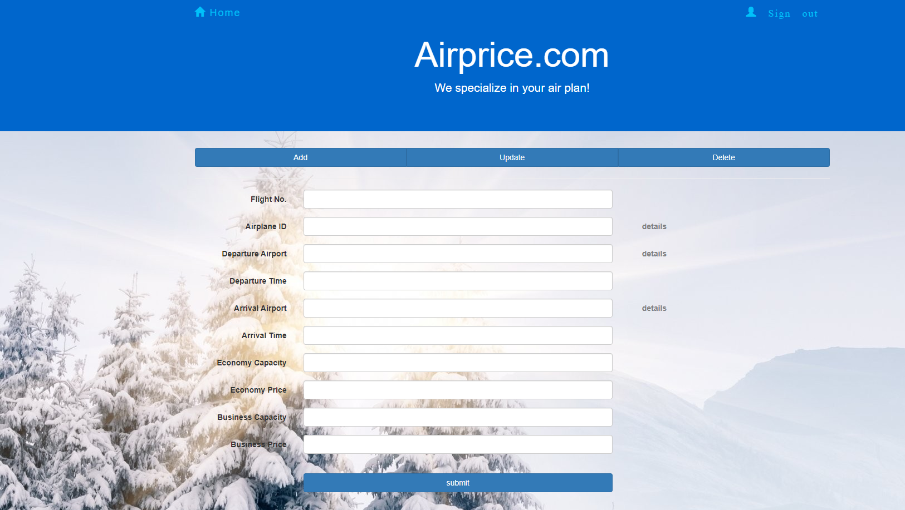
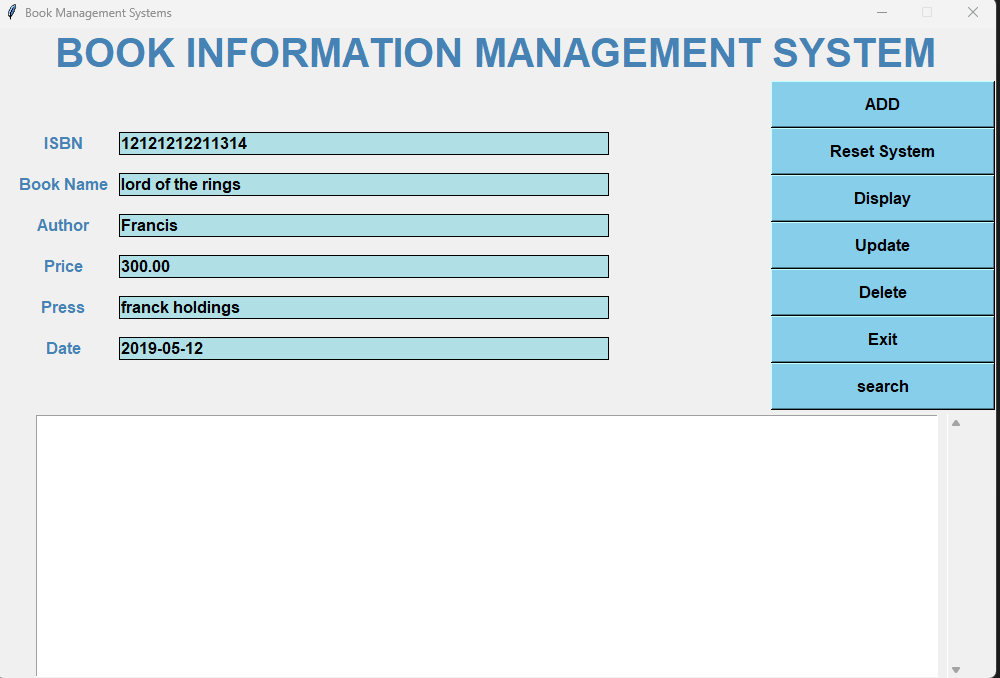
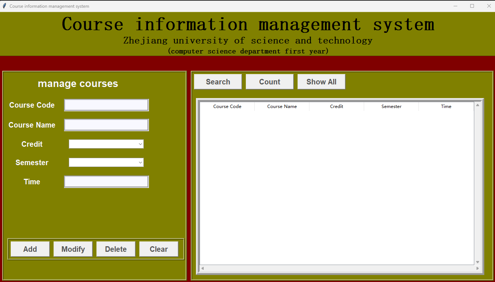
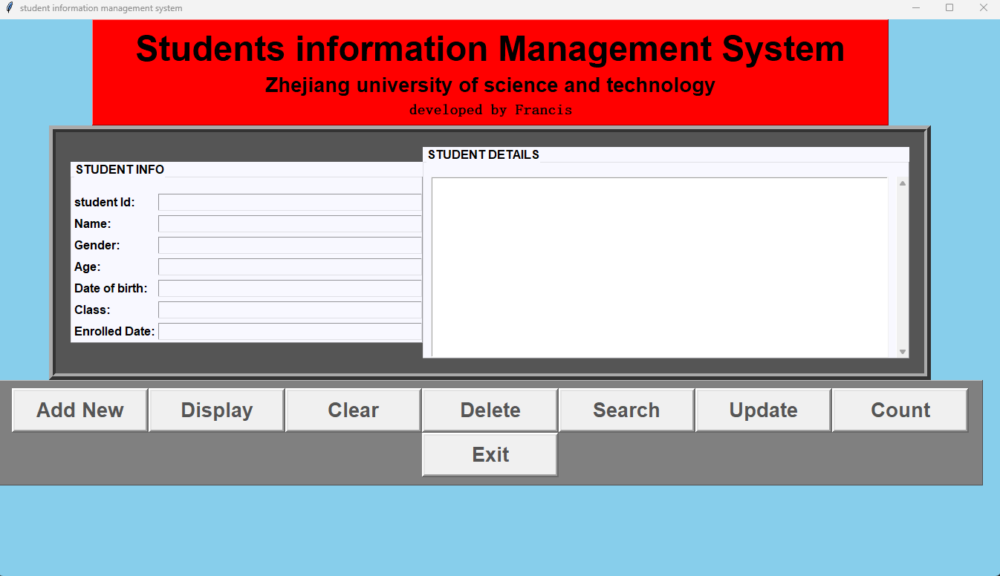
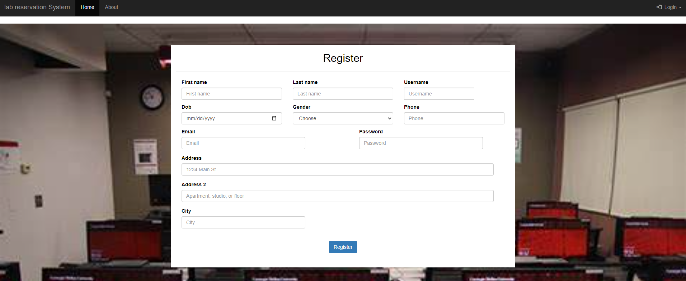

# humble_beginnings

This is repository containing few of the numerous fun projects i did after i realized how passionate i was about software engineering(2019-2020).

## Projects

- [Airline Booking System](https://github.com/francohandel/humble_beginnings/tree/main/airline_booking_system)
- [Book Management System](https://github.com/francohandel/humble_beginnings/tree/main/book_management_system)
- [Bus Seat Booking System](https://github.com/francohandel/humble_beginnings/tree/main/bus_seat_booking_system)
- [Course Info Management System](https://github.com/francohandel/humble_beginnings/tree/main/course_info)
- [Lab Reservation System](https://github.com/francohandel/humble_beginnings/tree/main/lab_reservation)
- [Mini Voting System](https://github.com/francohandel/humble_beginnings/tree/main/mini-voting-system)
- [Natours Project](https://github.com/francohandel/humble_beginnings/tree/main/Natours_project)
- [Phone Contact Tool](https://github.com/francohandel/humble_beginnings/tree/main/phone_contacts_tool)
- [Student Management System](https://github.com/francohandel/humble_beginnings/tree/main/student_management)

## Screenshots

 

 

 

 

 

 

## Usage

- for Projects written in django use "python manage.py runserver"
- for projects written in python use run them as you would run a python script
- for Natours project run the index.html file with live server
- for projects written in C you can compile and build intoa .Exe file
# Note
For projects requiring databases make sure you have a working database connection before running the projects 